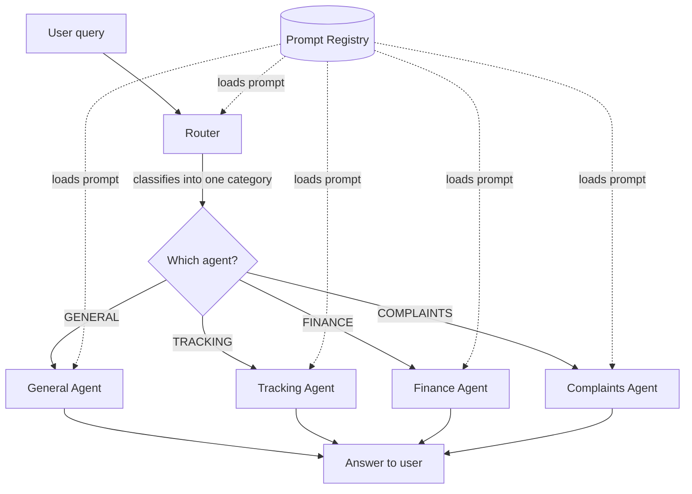

# Nereixa Support Bot

A small multi-agent customer-support chatbot built to get one thing right: **clean prompt management** in LangChain.


-orange)


---

## Why I built this

I'm working towards a larger multi-agent assistant, and before adding all of that complexity, I wanted to nail one specific skill properly: **how to manage prompts the way a real production codebase would** — versioned, centralized, and separate from the application logic.

So I built this as a focused practice project: a customer-support bot for a fictional e-commerce company, *Nereixa Pvt Ltd*. The chatbot itself is intentionally kept simple. The interesting part — and the whole reason this repo exists — is the prompt-management layer underneath it.

If you're learning LangChain and wondering how to stop hardcoding prompts all over your code, this is a small, readable example of one clean way to do it.

---

## What it does

A user asks a question. A **router** reads the question and decides which of four specialist agents should answer it. That agent then replies using its own prompt.

The four agents:

| Agent | Handles |
|-------|---------|
| **General** | Greetings, farewells, business hours, return policy, general T&C |
| **Tracking** | Order location, delivery date, full delivery status |
| **Finance** | Refund status, taxation, cancellation charges |
| **Complaints** | Technical issues, billing errors, service delays, escalations |

Every prompt — including the router's — is loaded from a single registry. Changing how an agent behaves means editing **one file**, never the code that runs it.

---

## How it works



The flow in plain terms:

1. **Router** takes the query and returns one category (e.g. `TRACKING`). It only decides — it never answers.
2. **The chosen agent** loads its own prompt from the registry and generates the reply.
3. **The registry** is the single source of truth for every prompt — the router and all four agents pull from it.

Notice the router and the agents never contain prompt text themselves. They ask the registry for it by name.

---

## Prompt management (the core idea)

This is what the project is really about.

Instead of writing prompts inline inside each agent, every prompt lives as a small dictionary that carries its **text plus metadata**:

```python
GENERAL = {
    "version": "V1.0",
    "update_time": "2026-06-18",
    "target_model": "gpt-4o-mini",
    "text": "You are the General Agent of Nereixa Pvt Ltd. ...",
}
```

A **registry** then maps a name to each prompt and exposes one simple function to fetch it:

```python
PROMPT_REGISTRY = {
    "router": ROUTER,
    "general": GENERAL,
    "tracking": TRACKING,
    "finance": FINANCE,
    "complaints": COMPLAINTS,
}

def get_prompt(agent_name: str) -> str:
    return _get(agent_name)["text"]
```

What this buys me:

- **Change a prompt in one place.** Edit `agents.py`; the whole app updates. The agent logic stays untouched.
- **Versioning.** Each prompt records its version and last-updated date, so I can track changes and roll back.
- **Consistency.** Every agent loads the same way — the router output (uppercase like `TRACKING`) is normalized to match the registry keys, so lookups don't break.
- **Scale.** Adding a fifth agent is just one new prompt and one registry entry. No new logic.

Because of this, a single generic function runs *all* four agents — the only thing that changes between them is the prompt it fetches by name.

---

## Project structure

```
PromptManagement-Chatbot/
├── prompts/
│   ├── __init__.py
│   ├── agents.py          # all prompts (router + 4 agents) with version + metadata
│   └── registry.py        # central loader: get_prompt(), the registry dict
├── router.py              # decides which agent should handle a query
├── agent_runner.py        # generic run_agent() that runs any agent by name
├── main.py                # the chat loop that ties everything together
├── requirements.txt
└── README.md
```

---

## Tech stack

- **Python 3.12**
- **LangChain** (`langchain-core`) — prompt templates, LCEL chains, output parsing
- **Groq** via `langchain-groq` — running the `gpt-oss-120b` model
- **python-dotenv** — for the API key

---

## Getting started

**1. Clone and enter the project**
```bash
git clone https://github.com/Nitesh-lng/PromptManagement-Chatbot.git
cd PromptManagement-Chatbot
```

**2. Create a virtual environment and install dependencies**
```bash
python3 -m venv venv
source venv/bin/activate          # Windows: venv\Scripts\activate
pip install -r requirements.txt
```

**3. Add your Groq API key**

Create a `.env` file in the project root:
```
GROQ_API_KEY=your_key_here
```
You can get a free key from [console.groq.com](https://console.groq.com).

**4. Run it**
```bash
python main.py
```

---

## Example

```
Enter your query (or type 'exit' to quit): where is my order
Routed to agent: TRACKING
Agent Response:
Sure, I'd be happy to check that for you! Could you please provide your
Order ID or Tracking Number (it looks something like NX-12345) so I can
locate your shipment?
```

The router sent the query to the Tracking agent, which then responded exactly as its prompt instructed — asking for an order ID in the expected format.

---

## Concepts this project demonstrates

- Centralized **prompt management** with a registry
- **Prompt versioning** and metadata
- **Supervisor / router** multi-agent architecture
- **Few-shot prompting** (used inside the router prompt to improve classification)
- **LCEL** chains (`prompt | model | parser`)
- `ChatPromptTemplate` with separate system and human roles
- Keeping prompts fully separated from application logic

---

## Roadmap

This is a foundation I plan to extend:

- [ ] **Conversation memory** so the bot can handle follow-up questions ("how much is that?")
- [ ] **Structured-output routing** for even more reliable classification
- [ ] A smaller, cheaper model dedicated to routing
- [ ] More agents (product info, cancellations)
- [ ] Basic tests for the registry and routing

---

## A note

This is a learning project, built to practise prompt management before applying it in a bigger system. The company and all data are fictional and the responses use mock logic. Feedback and suggestions are welcome.

## License

MIT — feel free to use this as a reference for your own projects.
